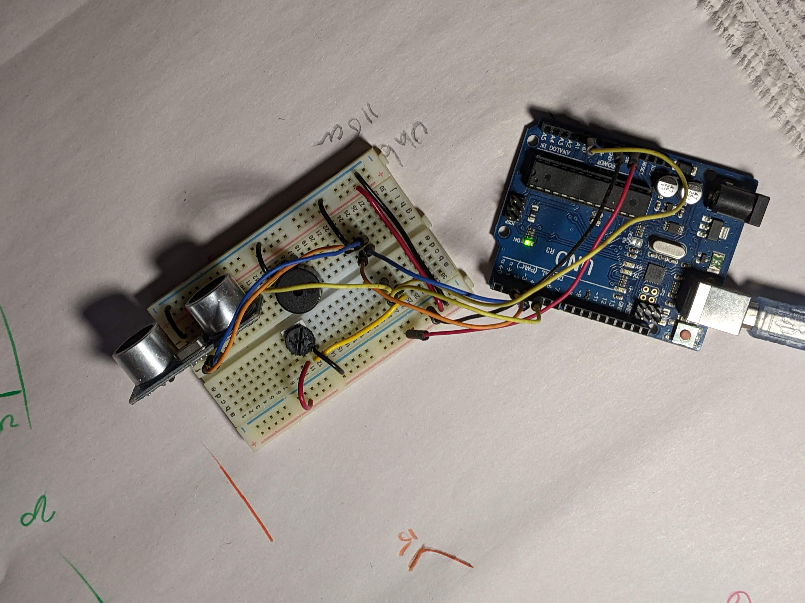
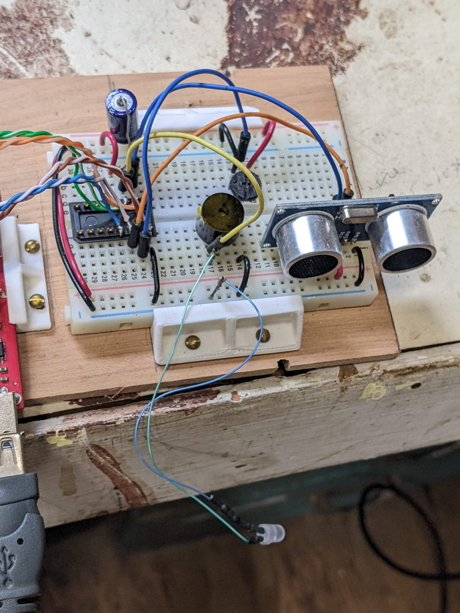
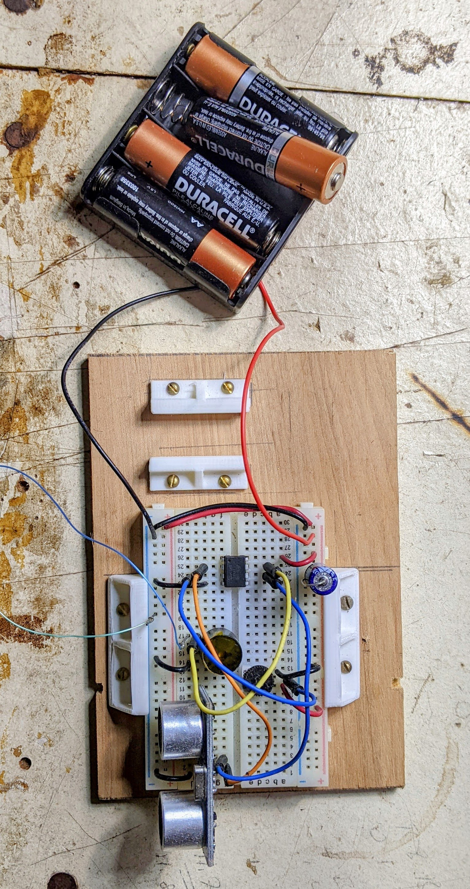
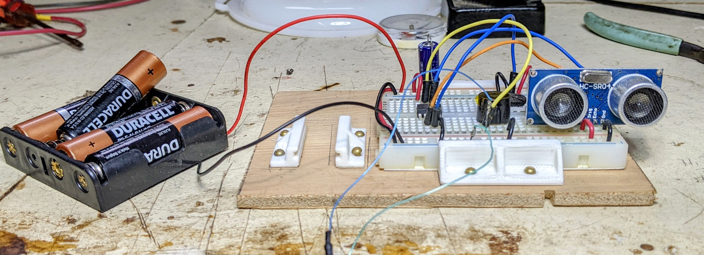

# Range Monitor
An occupational therapist posted a comment and a need request for a range finder with automatic feed back for helping to train people new to powered wheelchairs.  This device was meant to emulate (BUT NOT REPLACE) a much more expensive system that is build into some powered chairs. The system is designed to alert the user when they are too close to some potential hazards. After a few questions and answers it was determined that instead of making one unit with multiple sensors we would start with a compact single sensor that could be replicated easily.  The idea is be able to clip these on to standard wheelchairs for the limited time it takes to train new users. **It isn't intended nor designed to replace a sophisticated ranging system that has been tested, debugged, fault tolerant and integrated into a powered chair system.**  It is assumed that the user is in the capapble hands of a trainer who is helping to assist with the learning process.

## Goal
The concept is simple: we want to build a low power device that can run on a small rechargable cell that detects the distance from an obsticle. We want to make it cheap and easy to construct so we can place as many as needed to emulate a sophisticated laser system. Ulimtately we will use an attiny-85 with a sonic ranging device and a piezo buzzer.  The device will have a means of setting the limits on how far out to look. Sonic range finders don't have the range of laser sensors nor the spread but by arranging arrays of these devices we can emulate the same effect.

## Start
We begin with an old school UNO that I have laying around to tinker with how to select distances and develop the interface for setting the limit.  I also want a feel for the angular sensitivity and accuracy of the distance monitoring. With an UNO (or similar such) I can get printouts of the status of the system.  Once the basic design elements start to gel I'll switch to the attiny to see how compact and low power I can make the device.

Quick and dirty circuit layout with visual feedback (using built-in LED)

Showing the activation of feedback based on pot setting.

## First impressions
> 04/10/2022
The HC-SR04 lives up to its reputation as detecting things up to about 4m away and down to 6cm without a hitch.  I compared the distance to value set by a 100k pot and was able flash the built-in led whenever I was inside the threshhold. The angular range is about a 25 deg cone (empirically) which is close to the 15 deg (either side from center) value reported on the spec sheets.

> 04/10/2022
Added Piezo alarm to warn of proximity.  Seems to work well but may require amplification.

> 05/15/2022
Getting the hardware to play nice with the ATTiny85 was a bit tricky having to do with setting the proper clock speed and handling the timing of the incoming and outgoing signals (who new delaymicroseconds was so twitchy?)  Finally got the software to do as I wanted with the sonic alert and variable distance. 

*Yeah, I know this wont show*

> 06/27/2022
Schools out and I can finally proof this thing. I have finally figured out the wierd timing of the ATTiny. I have characterized the device as to current consumption and tested it with batteries.  The final breadboard is pretty compact I can probably package this into a box slightly larger than a AA 4 pack. 
 

The device consumes ~ 11mA while testing the surroundings and 41mA when whistling an immanent collision. The sound isn't loud but readily discernable for training purposes.  A set of 4 AA would last at least 60hrs if not more with normal use.  4 rechargable AAs would also work with this setup.  (device works down to about 4V)

Off camera I am bringing the flat of my hand in and away from the sensor. The pot on top determines where the trigger point is and for this video it is set to about 40cm.